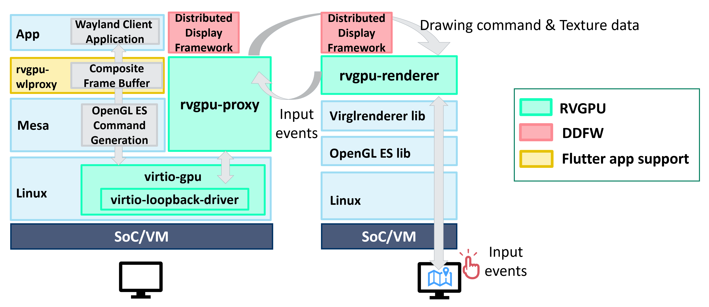

<picture>
<h1 align="center">

</h1>
</picture>

**"Unified HMI" is a `Software-Defined` display virtualization platform based on VirtIO GPU tecnology. Unified HMI allows for flexible development of the entire cockpit and cabin UI/UX, across multiple displays, independent of hardware and OS configuration.**

<picture>

</picture>
 

# Unified HMI architecture

Unified HMI consists of two main components:

1. Remote VirtIO GPU Device(RVGPU)：Render apps remotely in different SoCs.
2. Distributed Display Framework(DDFW)：Flexible layout control of apps across multiple displays.

<picture>

</picture>

## Remote Virtio GPU (RVGPU)

**RVGPU is a client-server based rendering engine, which allows to render 3D on one device (client) and display it via network on another device (server)**

RVGPU consists of three repositories:

1. [remote-virtio-gpu](https://github.com/unified-hmi/remote-virtio-gpu): Main framework of RVGPU.
2. [virio-loopback-driver](https://github.com/unified-hmi/virtio-loopback-driver): Capture the drawing commands for VirtIO GPU and transfer them to the RVGPU framework.
3. [rvgpu-wlproxy](https://github.com/unified-hmi/rvgpu-wlproxy): Apply applications that operate on the Wayland Protocol, including Flutter apps, to RVGPU.

## Distributed Display Framework (DDFW)

**DDFW provides essential services for managing distributed display applications. This framework is designed to work with a variety of hardware and software configurations, making it a versatile choice for developers looking to create scalable and robust display solutions.**

DDFW consists of three repositories:

1. [ucl-tools](https://github.com/unified-hmi/ucl-tools): Unified Clustering Tools (UCL), launch applications for multiple platforms and manage execution order and survival.
2. [ula-tools](https://github.com/unified-hmi/ula-tools): Unified Layout Tools (ULA), application layout for virtual displays on virtual screen (mapped from physical displays).
3. [uhmi-ivi-wm](https://github.com/unified-hmi/uhmi-ivi-wm): Apply ivi-layer and ivi-surface layouts to the screen using the layout design output by ula-tools.

## How to use Unified HMI
The usage instructions for each framework are documented in their respective README files.

### How to use RVGPU version v2.0.0 or higher with DDFW
Using `remote-virtio-gpu` and `ucl-tools` version v2.0.0 or higher together, you can easily achieve displaying multiple rvgpu-proxy renderings with a single rvgpu-renderer.
This enables launching multiple applications with RVGPU and efficient management of the lifecycle (e.g., running or stopped) for multiple applications.
For detailed instructions on how to launch multiple applications with RVGPU and manage lifecycle, please refer to [Here](https://github.com/unified-hmi/ucl-tools?tab=readme-ov-file#how-to-run-ucl-with-rvgpu-version-v200-or-higher).

Using `remote-virtio-gpu` and `ula-tools` version v1.1.0 or higher together, you can achieve unified control of the application layouts on RVGPU.
This enables efficient management of multiple application arrangements and displays on the virtual screen.
For detailed instructions on how to control layouts on the RVGPU compositor, please refer to [Here](https://github.com/unified-hmi/ula-tools?tab=readme-ov-file#how-to-control-layouts-on-rvgpu-compositor).

Using RVGPU with DDFW allows you to easily manage the lifecycle of multiple applications and control their layouts across multiple displays, independent of hardware and OS configurations.

### How to use RVGPU version v1.1.0 with DDFW on AGL UCB
[Here](https://docs.automotivelinux.org/en/master/#06_Component_Documentation/11_Unified_HMI/) is the documentation for verifying the operation of the Unified HMI framework on AGL.
Please also refer to this for the procedure that combines RVGPU and DDFW.
