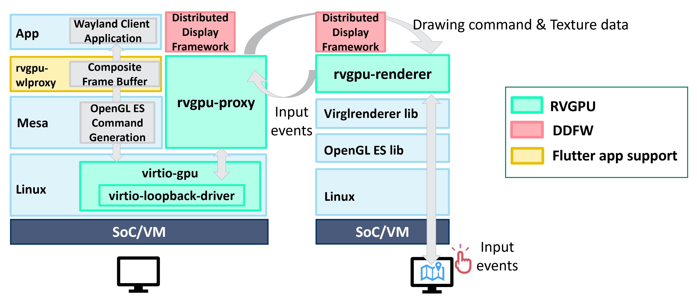

<picture>
<h1 align="center">

</h1>
</picture>

**"Unified HMI" is a `Software-Defined` display virtualization platform based on VirtIO GPU technology. Unified HMI allows for flexible development of the entire cockpit and cabin UI/UX, across multiple displays, independent of hardware and OS configuration.**

<picture>

</picture>
 

# Unified HMI architecture

Unified HMI consists of two main components:

1. Remote VirtIO GPU Device (RVGPU): Render apps remotely in different SoCs.
2. Distributed Display Framework (DDFW): Flexible layout control of apps across multiple displays.

<picture>

</picture>

## Remote VirtIO GPU (RVGPU)

**RVGPU is a client-server based rendering engine, which allows to render 3D on one device (client) and display it via network on another device (server)**

RVGPU consists of three repositories:

1. [remote-virtio-gpu](https://github.com/unified-hmi/remote-virtio-gpu): Main framework of RVGPU.
2. [virtio-loopback-driver](https://github.com/unified-hmi/virtio-loopback-driver): Capture the drawing commands for VirtIO GPU and transfer them to the RVGPU framework.
3. [rvgpu-wlproxy](https://github.com/unified-hmi/rvgpu-wlproxy): Run Wayland client applications on RVGPU by bridging them into the virtio-gpu session.

## Distributed Display Framework (DDFW)

**DDFW provides essential services for managing distributed display applications. This framework is designed to work with a variety of hardware and software configurations, making it a versatile choice for developers looking to create scalable and robust display solutions.**

- [unified-hmi](https://github.com/unified-hmi/unified-hmi): A distributed display framework that orchestrates application lifecycles and window layout across master and worker nodes, using RVGPU-based virtio-GPU proxies for GPU/Wayland tunneling. It provides a gRPC-first control plane with a unified `UHMIService` for orchestration, app-lifecycle, and window-management operations.

## How to use Unified HMI
The usage instructions for each framework are documented in their respective README files.

### How to use Unified HMI with RVGPU

Using [unified-hmi v3.0.0](https://github.com/unified-hmi/unified-hmi/tree/v3.0.0) with [remote-virtio-gpu v2.1.0](https://github.com/unified-hmi/remote-virtio-gpu/tree/v2.1.0), you can display the output of multiple rvgpu-proxy instances with a single rvgpu-renderer, and manage the lifecycle and layout of multiple applications across displays.

### How to use Unified HMI on AGL

The [AGL Unified HMI documentation](https://docs.automotivelinux.org/en/master/06_Component_Documentation/60_Unified_HMI/01_Unified_HMI/) describes how to use Unified HMI with the legacy DDFW on AGL.
Support for `unified-hmi` v3.0.0 and RVGPU v2.1.0 on AGL is in progress.

### Legacy DDFW

Previous DDFW releases were provided as [ucl-tools](https://github.com/unified-hmi/ucl-tools), [ula-tools](https://github.com/unified-hmi/ula-tools), and [uhmi-ivi-wm](https://github.com/unified-hmi/uhmi-ivi-wm). New users should use [unified-hmi](https://github.com/unified-hmi/unified-hmi).
